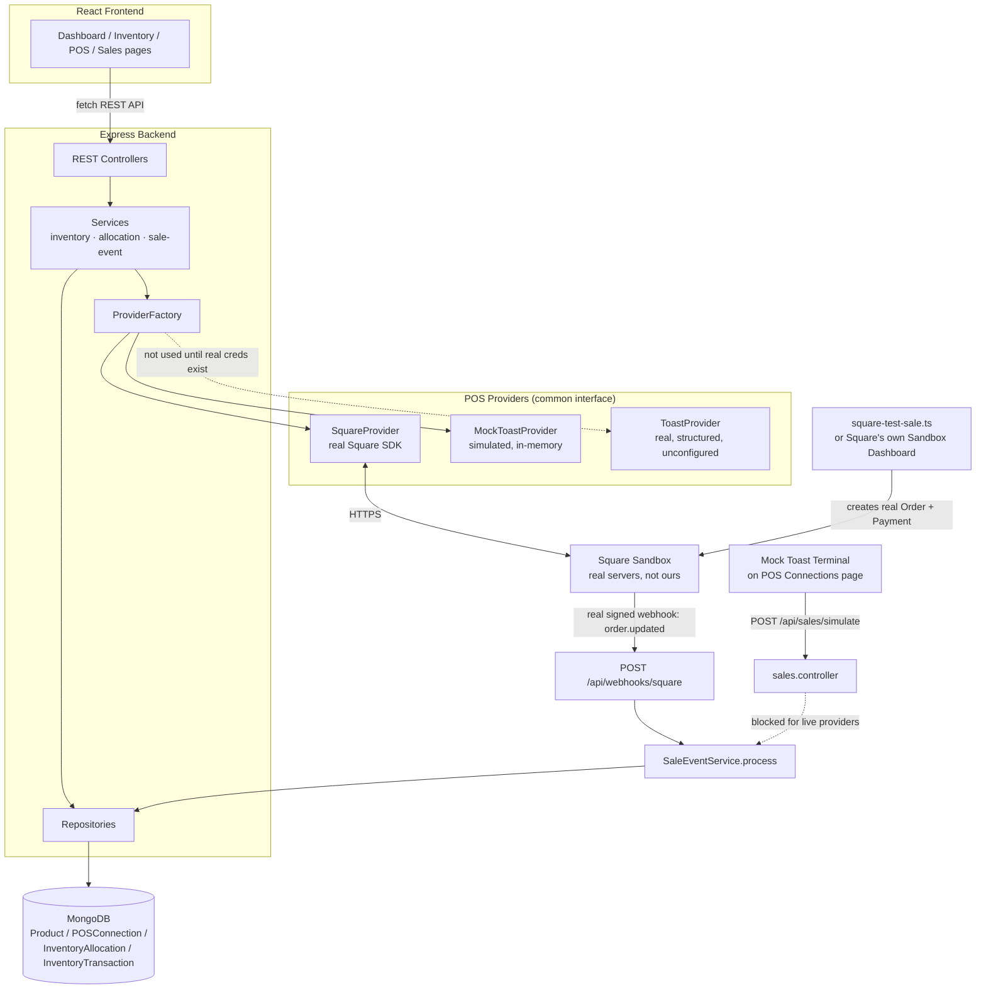
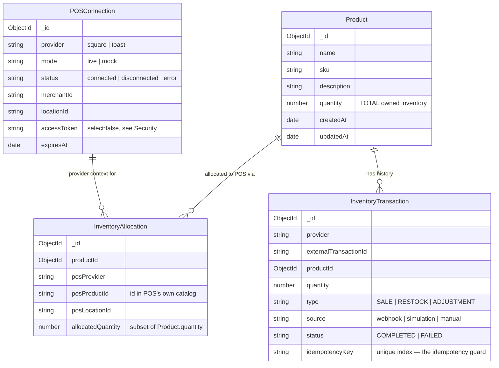
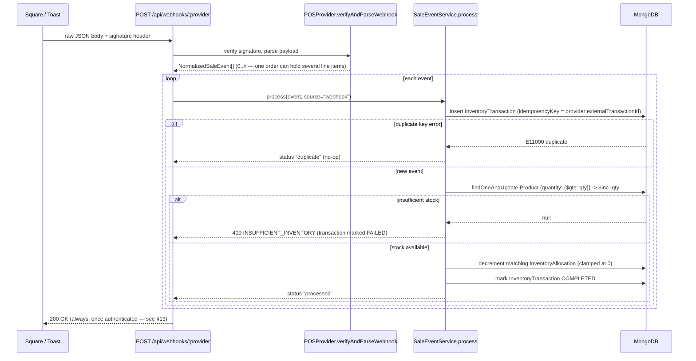

# Inventory Management Platform — POS Integration Demo

A take-home exercise demonstrating an inventory platform that integrates with **Square** (real
sandbox API) and **Toast** (structured for the real API, running in a clearly-labeled **Mock
Mode** since no Toast developer credentials were available). It shows the complete flow:
connect a POS → create inventory → allocate inventory to the POS → a sale happens on the POS →
the platform detects it → inventory is depleted automatically, atomically, and idempotently.

- [1. Project Overview](#1-project-overview)
- [2. Architecture Diagram](#2-architecture-diagram)
- [3. Technology Choices](#3-technology-choices)
- [4. Database Model](#4-database-model)
- [5. POS Adapter Architecture](#5-pos-adapter-architecture)
- [6. Square Integration](#6-square-integration)
- [7. Toast Integration](#7-toast-integration)
- [8. Mock Toast Mode](#8-mock-toast-mode)
- [9. Webhook Flow](#9-webhook-flow)
- [10. Inventory Allocation Logic](#10-inventory-allocation-logic)
- [11. Idempotency Strategy](#11-idempotency-strategy)
- [12. Concurrency / Inventory Consistency](#12-concurrency--inventory-consistency)
- [13. Error Handling](#13-error-handling)
- [14. Security Considerations](#14-security-considerations)
- [15. Environment Variables](#15-environment-variables)
- [16. Local Setup](#16-local-setup)
- [17. Running the Backend](#17-running-the-backend)
- [18. Running the Frontend](#18-running-the-frontend)
- [19. Seeding Demo Data](#19-seeding-demo-data)
- [20. Demonstrating the Full Workflow](#20-demonstrating-the-full-workflow)
- [21. Production Considerations](#21-production-considerations)
- [Testing](#testing)
- [Tradeoffs Made in This Implementation](#tradeoffs-made-in-this-implementation)

---

## 1. Project Overview

The platform has two independent pieces:

- **backend/** — Node.js + Express + TypeScript REST API, MongoDB via Mongoose. Owns the
  inventory ledger and exposes it to POS systems through a common adapter interface.
- **frontend/** — React + TypeScript + Redux Toolkit + React Router + Tailwind CSS dashboard
  (Vite build) for managing products, POS connections, allocations, and sales.

The one rule the whole system is built around: **there is exactly one code path that ever
changes inventory numbers** — `SaleEventService.process()`. A real Square webhook and a Mock
Toast Terminal sale both funnel into it — nothing about Toast being mocked is "faked
separately" from what a real webhook-driven integration would do. Square, once connected with a
real sandbox token, can **only** be depleted by a genuine, signature-verified Square webhook —
`sales.service.ts` actively refuses to let a "live" provider be depleted any other way (see §9).

## 2. Architecture Diagram



## 3. Technology Choices

| Layer | Choice | Why |
| --- | --- | --- |
| API | Express + TypeScript | Minimal ceremony, explicit routing, easy to review in a take-home |
| DB | MongoDB + Mongoose | Flexible schema for a fast-moving demo; atomic single-document updates are a natural fit for the inventory-decrement guard (see §12) |
| Frontend | React + TypeScript (Vite) + Redux Toolkit + React Router + Tailwind | Redux Toolkit's `createAsyncThunk`/`createSlice` gives a clear, testable data layer; a thin services layer (`fetchGet`/`fetchPost`) keeps the frontend fully decoupled from the backend |
| POS SDK | Official `square` Node SDK | Avoids hand-rolling request signing/typing for a real, reviewable integration |
| Tests | Jest + mongodb-memory-server + supertest | Real MongoDB semantics (unique indexes, atomic updates) without a shared test database; supertest exercises the actual Express app, not just services |

**Frontend structure** (`frontend/src/`): `services/` — one file per domain, thin `fetch` wrappers
returning parsed data or throwing a `{code, message}` error (`utilities/fetchGet.ts` /
`fetchPost.ts`). `redux/` — one slice per domain (`inventorySlice.ts`, `posSlice.ts`,
`salesSlice.ts`, `dashboardSlice.ts`, `notificationsSlice.ts`), each combining its
`createAsyncThunk`s, state, and selectors in a single file — deliberately flat rather than
split into `consts/slice/selectors/hooks` per domain, since an app this size doesn't carry its
weight (see below). `pages/` — one component per route plus `AppRoutes.tsx` (routing) and
`index.tsx` (store `Provider` + routes). `components/` — shared UI flat at the top level,
domain-specific pieces (`pos/`, `inventory/`, `notifications/`) in their own folders.

## 4. Database Model



Key relationships:

- `InventoryAllocation` is the join between a `Product` and a POS channel. Its
  `(productId, posProvider, posLocationId)` combination is uniquely indexed, and
  `(posProvider, posProductId)` is indexed separately so an inbound webhook (which only knows
  the POS's own product id) can resolve back to our product in one query.
- `InventoryTransaction.idempotencyKey` has a **unique index** — this is the entire idempotency
  mechanism (§11).

## 5. POS Adapter Architecture

Every POS integration implements one interface, `POSProvider`
(`backend/src/providers/pos-provider.interface.ts`):

```ts
connect() · disconnect() · getLocations() · createProduct() · getProducts()
allocateInventory() · updateInventory() · getSales() · verifyAndParseWebhook()
```

`ProviderFactory.get(provider)` is the only place that decides which concrete class backs a
given provider name. Controllers and services depend only on the interface — never on
`SquareProvider` or `MockToastProvider` directly — so a third POS could be added by writing one
new class and adding one line to the factory switch, without touching inventory or webhook
logic.

```
providers/
  pos-provider.interface.ts   ← the contract
  provider.factory.ts         ← picks the concrete implementation
  square/
    square.provider.ts        ← real Square SDK integration
    square.client.ts
    square.oauth.ts
  toast/
    toast.provider.ts         ← real Toast skeleton (throws a clear "not configured" error)
  mock/
    mock-toast.provider.ts    ← full simulated Toast, same interface
```

`verifyAndParseWebhook` is async and returns an **array** of normalized sale events, not a
single event — see §9 for why (Square's webhook body doesn't carry line items directly).

## 6. Square Integration

Implemented against the official [`square`](https://github.com/square/square-nodejs-sdk) Node
SDK (v38), using:

- **Locations API** (`listLocations`) — connect + location resolution
- **Catalog API** (`upsertCatalogObject`, `listCatalog`) — creating/reading products
- **Inventory API** (`batchChangeInventory`, `PHYSICAL_COUNT`) — pushing allocation counts
- **Orders API** (`retrieveOrder`, `searchOrders`) — resolving webhook line items
- **OAuth API** (`obtainToken`) — full OAuth code exchange
- Manual HMAC-SHA256 webhook signature verification (`x-square-hmacsha256-signature`)

**Local dev path (recommended for this demo):** set `SQUARE_ACCESS_TOKEN` in `backend/.env` to
a sandbox access token from the
[Square Developer Dashboard](https://developer.squareup.com/apps) → your app → Sandbox. Clicking
**Connect Square** in the UI then calls `LocationsApi.listLocations()` with that token — no
OAuth redirect needed.

**Full OAuth path:** `GET /api/pos/square/oauth/authorize` builds the authorize URL from
`SQUARE_CLIENT_ID` / `SQUARE_REDIRECT_URI`; `GET /api/pos/square/oauth/callback` exchanges the
returned `code` for an access token via `OAuthApi.obtainToken()` and stores it. The code is
structured so this activates automatically once those env vars are set — no code changes
needed.

**⚠ Verify against current docs before a live demo.** The SDK's exact method/field names were
checked against the specific `square@38.2.0` version installed in this repo (see comments in
`square.provider.ts`), but Square's SDK and webhook event shapes evolve. In particular:
webhook event type names (`order.updated` is used here), the exact Order → line item shape, and
the signature header name should be re-confirmed against
[developer.squareup.com](https://developer.squareup.com/docs) if `npm install` resolves a
different major SDK version.

### Setting up real webhook delivery (ngrok)

Square needs a public HTTPS URL to deliver webhooks to — `localhost` isn't reachable from
Square's servers. For local development/demoing:

```bash
ngrok http 4000
```

Then, in the [Developer Console](https://developer.squareup.com/apps) → your app → **Webhooks**
→ **Subscriptions** → **Add subscription**: paste the ngrok HTTPS URL + `/api/webhooks/square`
as the notification URL, subscribe to `order.updated` (and `order.created`), save, then open the
new subscription and reveal its **signature key**. Put both into `backend/.env`:

```
SQUARE_WEBHOOK_SIGNATURE_KEY=<the revealed key>
SQUARE_WEBHOOK_NOTIFICATION_URL=https://<your-ngrok-subdomain>.ngrok-free.app/api/webhooks/square
```

`SQUARE_WEBHOOK_NOTIFICATION_URL` must match **exactly** what you registered — Square's
signature is computed over `notificationUrl + rawBody`, so a mismatch (including a trailing
slash) fails every verification.

### Triggering a real sandbox sale

The real [Square Point of Sale app is not supported in Sandbox](https://developer.squareup.com/docs/devtools/sandbox/overview)
(confirmed against current docs), so there's no physical/app terminal to tap. Two ways to
trigger a genuine sandbox sale instead — both are processed by Square's own servers, not by
this platform:

1. **Square's own Sandbox Dashboard.** Developer Console → your app → Sandbox test account →
   **Square Dashboard** → look for **Create Order** / **Take a payment**. Availability of this
   UI has varied over time per Square's own developer forum, so check what your account has;
   if present, this is the closest thing to literally ringing up a sale on Square's own POS
   interface.
2. **`npm run square:test-sale`** (in `backend/`) — a standalone script, deliberately kept
   outside this platform's own API, that creates a real Order + Payment against your sandbox
   using Square's documented test nonce (`cnon:card-nonce-ok`):

   ```bash
   npm run square:test-sale -- --variationId=<square catalog id> --locationId=<square location id> --quantity=2
   ```

   Get `--variationId` from a product's **POS Allocations** table on its Product Detail page
   (the `posProductId` Square assigned when you allocated inventory to it) or from Square's own
   Items dashboard. Get `--locationId` from the POS Connections page or Square's dashboard.

Either way, Square processes a real transaction and delivers a real, signed webhook to
`/api/webhooks/square` — the platform depletes inventory the same way it would for an actual
in-store sale.

## 7. Toast Integration

`backend/src/providers/toast/toast.provider.ts` is a **real, structured skeleton** — correct
method signatures implementing `POSProvider`, referencing Toast's actual documented API
surface (Authentication, Menus, Orders, Webhooks — see
[doc.toasttab.com](https://doc.toasttab.com)) — but every method throws a clear
`TOAST_NOT_IMPLEMENTED` / `TOAST_NOT_CONFIGURED` error rather than guessing at request/response
shapes that couldn't be verified without a Toast developer account.

Setting `TOAST_MODE=live` with `TOAST_ACCESS_TOKEN` and `TOAST_RESTAURANT_GUID` routes
`ProviderFactory` to this class instead of the mock — see §21 for what's left to implement.

**Why Toast is mocked, concretely:** confirmed against
[Toast's current developer docs](https://doc.toasttab.com/doc/devguide/integrationDevProcess.html),
Toast runs a closed partner program — sandbox credentials are only issued *after* applying,
being vetted for business fit, and signing a partner agreement. There is a self-serve "Standard
API access" tier, but it's read-only, has no sandbox, and requires already having permission
from a live restaurant — none of which fits a take-home exercise on a short timeline. A partner
application was submitted in parallel with this build; if credentials arrive, `ToastProvider`
already implements the correct interface and just needs its methods filled in against verified
request/response shapes — no architectural changes required.

## 8. Mock Toast Mode

`backend/src/providers/mock/mock-toast.provider.ts` fully implements `POSProvider` with an
in-memory simulated Toast catalog (per-connection, so it isolates state cleanly). It reports
`mode = 'mock'`, and **that field is what the UI reads** — `POSConnection.mode` is persisted and
returned by `GET /api/pos/connections`, and the POS Connections page renders an explicit amber
**"Mock Mode"** badge plus a disclaimer line, distinct from Square's green **"Connected
(Live)"** badge. There is no code path where a mock connection can render as "Connected" the way
a live one does.

The mock catalog is intentionally **not** persisted to MongoDB — it stands in for a system we
don't own (the real Toast's own database), so it resets when the server restarts. Our MongoDB
(`Product`, `InventoryAllocation`, `InventoryTransaction`) remains the durable source of truth
for every actual inventory number the UI shows. This is why `npm run seed` talks to the running
backend over HTTP rather than importing services directly — see §19.

The **Mock Toast Terminal** (a panel embedded directly in the Toast card on the POS Connections
page, only rendered when Toast is connected in mock mode) is the only place a Toast sale can
originate from — it stands in for Toast's own register the same way the terminal itself stands
in for Toast's API. It is *not* available for Square: `sales.service.ts` checks
`ProviderFactory.modeFor(provider)` and throws `SIMULATION_NOT_ALLOWED_FOR_LIVE_PROVIDER` if
you try to simulate a sale for any provider whose active adapter reports `mode: 'live'`. Once
Square is connected with a real sandbox token, its inventory can only be depleted by an actual,
signature-verified webhook — enforced in code, not just left as a UI convention.

## 9. Webhook Flow



Webhook routes (`backend/src/routes/webhook.routes.ts`) are mounted **before** the global
`express.json()` parser, using `express.raw()` instead — signature verification needs the exact
bytes the provider sent, not a re-serialized JSON object.

Square's order webhooks only include a thin reference (`order.updated` + an order id) — the
actual line items (which catalog product, how many) require a follow-up `retrieveOrder` call.
That's why `verifyAndParseWebhook` is `async` and returns an array: one order can produce
multiple `NormalizedSaleEvent`s. Toast's real webhook shape wasn't verified (§7), so its
`verifyAndParseWebhook` implements signature verification structurally and documents what's
unconfirmed.

## 10. Inventory Allocation Logic

**Chosen model: `Product.quantity` is the single source of truth for total owned inventory.
Each `InventoryAllocation` is a labeled subset of that total — how much is exposed for sale on
one POS channel — not a separate reserved pool that gets added on top of the total.**

Concretely, from the spec's own example:

```
Coca Cola, quantity: 100
Allocate 50 to Square         → Product.quantity still 100; Square allocation = 50
Customer buys 2 on Square     → Product.quantity: 100 → 98
                                 Square allocation:  50 → 48   (same 2 units, same event)
```

Both numbers move together because they describe the same 2 physical units leaving the
building — one at the "how much do we have" level, one at the "how much of that is Square's to
sell" level. This was the natural reading of the spec's worked example (100→98 and 50→48 from
a single sale of 2), and it avoids the double-booking bug a separate "reserved pool" model would
have (where allocating 50 to Square and 30 to Toast would have to reduce a shared "unallocated"
counter by 80, and then a sale would *also* need to reduce total stock — same units counted
twice).

The UI's "Available" column is **derived**, not stored: `quantity − Σ(allocations across all
providers)` — i.e. stock not yet exposed to any channel. `allocationService.allocate()` also
guards against allocating more than total stock to a single channel
(`ALLOCATION_EXCEEDS_STOCK`), though it deliberately does **not** block the sum of allocations
across *different* channels from exceeding total stock — some merchants intentionally
overcommit; see §21 for the production tradeoff.

## 11. Idempotency Strategy

`InventoryTransaction.idempotencyKey` (`${provider}:${externalTransactionId}`) has a **unique
Mongo index**. `SaleEventService.process()` always attempts to *insert* the transaction record
first. If that insert throws a duplicate-key error (code `11000`), the event has already been
processed — no inventory update happens, and the caller gets back the original result. This
means idempotency doesn't rely on an application-level "check, then act" — it's enforced by the
database itself, so it's correct even under concurrent duplicate deliveries (see §12).

Verified in `tests/sale-event.service.test.ts` and, at the full HTTP level, in
`tests/e2e.smoke.test.ts` (`sale_123` delivered twice → decremented once).

## 12. Concurrency / Inventory Consistency

Inventory is decremented with a single **atomic conditional update**:

```ts
Product.findOneAndUpdate(
  { _id: id, quantity: { $gte: amount } },
  { $inc: { quantity: -amount } },
  { new: true },
)
```

If two concurrent sales both try to take the last 2 units of a product with `quantity: 2`, only
one `findOneAndUpdate` can win the `$gte` guard atomically at the database level — the loser
gets `null` back and the sale is rejected with `INSUFFICIENT_INVENTORY`. This is verified with a
real concurrency test (`Promise.allSettled` firing two simultaneous sales at 2 units of stock —
`tests/sale-event.service.test.ts`).

The matching allocation decrement uses the same pattern via an **aggregation-pipeline update**
(`$max: [0, {$subtract: [...]}]`) so the "clamp at zero" logic is also atomic, not a
read-modify-write.

**Why not a multi-document MongoDB transaction?** Wrapping the transaction-insert +
product-decrement + allocation-decrement in one ACID transaction would give slightly stronger
guarantees, but MongoDB transactions require a replica set — not a plain standalone `mongod`,
which is what most reviewers will have running locally. Single-document atomic updates work
against a standalone instance and are sufficient for the one invariant that actually matters
(inventory never goes negative). The one gap this leaves: in the astronomically unlikely case
where two requests for the *same* event both pass the idempotency check at the same instant, the
loser's duplicate-key error arrives *after* it already decremented stock. This is called out in
code (`sale-event.service.ts`) and in §21 as the one thing a production system should close with
either a replica-set transaction or a distributed lock per idempotency key.

## 13. Error Handling

Centralized in `backend/src/middleware/error.middleware.ts`. Every domain error is a typed
`AppError` (`statusCode`, `code`, `message`) — controllers never construct raw
`res.status().json()` error bodies. Handled cases:

| Scenario | HTTP | Code |
| --- | --- | --- |
| Invalid/missing product fields | 400 | `VALIDATION_ERROR` |
| Product not found | 404 | `PRODUCT_NOT_FOUND` |
| Duplicate SKU | 409 | `DUPLICATE_SKU` |
| Insufficient inventory | 409 | `INSUFFICIENT_INVENTORY` |
| Allocation exceeds total stock | 400 | `ALLOCATION_EXCEEDS_STOCK` |
| POS not connected | 400 | `POS_NOT_CONNECTED` |
| Missing POS credentials | 400 | `MISSING_CREDENTIALS` |
| Square/Toast API failure | 502 | `SQUARE_API_ERROR` / `TOAST_NOT_IMPLEMENTED` |
| Invalid webhook signature | 401 | `INVALID_SIGNATURE` |
| Unmapped POS product in webhook | 422 | `UNMAPPED_POS_PRODUCT` |
| Duplicate webhook delivery | 200 | handled silently as a no-op (§11) |

**Webhook-specific choice:** once a webhook's signature is verified, per-event processing
failures (insufficient inventory, unmapped product) are still acknowledged with `200` — the
`InventoryTransaction` is recorded as `FAILED` for investigation via the Sales page, but the
platform does **not** make the POS retry-storm a problem retrying can't fix. Authentication
failures (bad signature) still surface as `401` so a genuinely malformed/unauthorized request is
rejected outright.

The frontend surfaces every `AppError` message via toast notifications
(`components/ToastProvider.tsx`) rather than generic "Something went wrong" text, using the
`code`/`message` the backend returns (`lib/errorMessage.ts`).

## 14. Security Considerations

- **No secrets reach the frontend.** `SQUARE_CLIENT_SECRET`, access tokens, etc. live only in
  `backend/.env` and are read via `backend/src/config/env.ts`. The frontend only ever calls our
  own REST API.
- **Tokens are excluded from default reads.** `POSConnection.accessToken` /
  `refreshToken` are `select: false` in the Mongoose schema — a normal `find()` never returns
  them; only the explicit `findByProviderWithSecrets` repository method does, and it's only used
  server-side to make an outbound POS call.
- **Webhook signature verification.** Square's HMAC-SHA256 signature is verified against the raw
  request body (`square.provider.ts`); Toast's structurally mirrors it once credentials exist.
- **Plaintext tokens in MongoDB (demo-only).** For this take-home, `accessToken`/`refreshToken`
  are stored as plain strings. **Production should encrypt these at rest** (e.g. envelope
  encryption via AWS KMS/GCP KMS, or a dedicated secrets manager like AWS Secrets Manager /
  HashiCorp Vault) rather than relying on MongoDB's disk-level encryption alone.
- **CORS** is restricted to `FRONTEND_ORIGIN` (`app.ts`), not `*`.

## 15. Environment Variables

See `backend/.env.example` and `frontend/.env.local.example` for the full annotated list.
Highlights:

| Variable | Purpose |
| --- | --- |
| `MONGODB_URI` | Standalone `mongod` connection string |
| `SQUARE_ACCESS_TOKEN` | Sandbox token — fastest way to demo real Square locally (§6) |
| `SQUARE_CLIENT_ID` / `SQUARE_CLIENT_SECRET` / `SQUARE_REDIRECT_URI` | Full OAuth flow |
| `SQUARE_WEBHOOK_SIGNATURE_KEY` / `SQUARE_WEBHOOK_NOTIFICATION_URL` | Required to verify real Square webhooks |
| `TOAST_MODE` | `mock` (default) or `live` |
| `TOAST_ACCESS_TOKEN` / `TOAST_RESTAURANT_GUID` | Only used when `TOAST_MODE=live` |
| `VITE_API_URL` (frontend) | Backend base URL, e.g. `http://localhost:4000/api` |

## 16. Local Setup

Prerequisites: Node.js 20+, a local MongoDB (`mongod` on `27017`, or any reachable
`MONGODB_URI` — see the note below if you don't have MongoDB installed).

```bash
git clone <this repo>
cd backend && npm install && cp .env.example .env
cd ../frontend && npm install && cp .env.local.example .env.local
```

**No local MongoDB installed?** The fastest path is a free
[MongoDB Atlas](https://www.mongodb.com/cloud/atlas) cluster — no local install, works from
anywhere, just paste the connection string in as `MONGODB_URI`. Alternatives: install MongoDB
Community Server, run `docker run -p 27017:27017 mongo`, or point `MONGODB_URI` at a
`mongodb-memory-server` instance (the same package the backend's test suite uses — see the
comment at the top of `backend/tests/setup.ts` for the pattern).

## 17. Running the Backend

```bash
cd backend
npm run dev       # nodemon + ts-node, http://localhost:4000
npm run build      # tsc -> dist/
npm start          # node dist/index.js
npm test           # jest (unit + integration, in-memory MongoDB)
```

## 18. Running the Frontend

```bash
cd frontend
npm run dev        # Vite dev server, http://localhost:3000
npm run build       # tsc -b && vite build -> dist/
npm run preview     # serve the production build locally
```

## 19. Seeding Demo Data

**Start the backend first**, then seed — the seed script talks to the running server over HTTP
(see §8 for why: `MockToastProvider`'s in-memory catalog only exists inside the server process
that creates it).

```bash
# terminal 1
cd backend && npm run dev

# terminal 2
cd backend && npm run seed
```

This creates Coca Cola (100), Sparkling Water (60), Cheeseburger (40), connects Mock Toast,
allocates 50 units of Coca Cola to Toast, and — if `SQUARE_ACCESS_TOKEN` is set — connects
Square and allocates 30 units there too.

## 20. Demonstrating the Full Workflow

### Path A — Square, fully live (the primary demo)

1. `npm run dev` in `backend/` and `frontend/`. Set `SQUARE_ACCESS_TOKEN` in `backend/.env`
   (§16/§6), then restart the backend.
2. Start `ngrok http 4000` and register the webhook subscription + signature key in Square's
   Developer Console (§6 "Setting up real webhook delivery").
3. Open `http://localhost:3000` → **POS Connections** → **Connect Square**. Status flips to
   **Connected (Live)** — this is a real `LocationsApi.listLocations()` call against Square.
4. **Inventory** → **Create Product** (e.g. Coca Cola, `COKE-001`, quantity 100).
5. **Allocate** → Square, quantity 50. This calls Square's real Catalog API to create the item
   and the Inventory API to set its sandbox stock count.
6. Trigger a real sale (§6 "Triggering a real sandbox sale") — either Square's own Sandbox
   Dashboard, or:
   ```bash
   cd backend && npm run square:test-sale -- --variationId=<from the product's POS Allocations table> --locationId=<from POS Connections> --quantity=2
   ```
7. Within a few seconds, Square delivers a real webhook to `/api/webhooks/square`. Refresh the
   **Dashboard** / **Inventory** / **Sales** pages — Coca Cola shows `100 → 98`, the Square
   allocation shows `50 → 48`, and a `SALE` transaction appears with Square's own order/line-item
   id as its external id. Nothing on the platform's own UI triggered this — it was detected.
8. Run the same test-sale script again with a fresh order — Square generates a new order id
   each time, so each is a distinct transaction. To see idempotency directly, replay a captured
   webhook payload at `/api/webhooks/square` with the same body twice — the second response
   shows `"status": "duplicate"` and inventory is unchanged.

### Path B — Toast, mocked (secondary, honestly labeled)

1. **POS Connections** → **Connect Toast**. Status shows the amber **Mock Mode** badge.
2. **Inventory** → allocate a product to Toast.
3. On the Toast card, use the **Mock Toast Terminal** to ring up a sale. It runs through the
   exact same `SaleEventService.process()` as a real webhook — see §8.

### Seeding for a quick baseline

```bash
# terminal 1
cd backend && npm run dev
# terminal 2
cd backend && npm run seed
```

Creates Coca Cola (100), Sparkling Water (60), Cheeseburger (40); connects Mock Toast and
allocates 50 units of Coca Cola to it; connects Square and allocates 30 units there too if
`SQUARE_ACCESS_TOKEN` is already set (§19).

## 21. Production Considerations

- **OAuth token refresh.** `POSConnection.expiresAt`/`refreshToken` are modeled but no refresh
  job exists — production needs a scheduled job (or lazy refresh-on-401) that uses
  `OAuthApi.obtainToken({grantType: 'refresh_token'})` before a Square token expires.
- **Webhook signature verification for Toast.** Structurally present but unverified against a
  real Toast payload (§7) — must be confirmed against a live sandbox before `TOAST_MODE=live`
  is trustworthy.
- **Retry queues / dead-letter queues.** Failed webhook events (unmapped product, transient POS
  API error while pushing `updateInventory` back) are currently just logged + marked `FAILED`.
  Production should push these onto a retry queue (SQS/BullMQ) with backoff, and a DLQ + alert
  after N failures — right now a human has to notice a `FAILED` row on the Sales page.
- **Distributed locking / transactions.** As discussed in §12, a production deployment with a
  MongoDB replica set should wrap the transaction-insert + decrement steps in a real session
  transaction (or a per-`idempotencyKey` distributed lock) to close the last-millisecond race
  described there.
- **Event ordering.** Nothing currently guarantees webhook events are processed in the order
  the POS sent them (Express handles requests concurrently). For inventory *decrements* this is
  safe (each decrement is independently atomic and idempotent), but if `RESTOCK`/`ADJUSTMENT`
  events were added, out-of-order delivery could matter — a per-product processing queue would
  be the fix.
- **Idempotency window.** Transaction records (and their idempotency keys) are kept forever
  currently, which is correct but unbounded; production would want a retention/archival policy
  once volume is large, while keeping the unique index live for at least the POS's realistic
  redelivery window.
- **Observability.** `utils/logger.ts` is a minimal structured console logger. Production should
  use pino/winston with a log aggregator, plus metrics (webhook latency, failure rate,
  inventory-decrement conflict rate) and tracing across the webhook → service → DB path.
- **Rate limits.** No rate limiting on either our own API or outbound POS calls. Square/Toast
  both enforce API rate limits — production needs backoff/retry with jitter on outbound calls,
  and probably a token-bucket limiter on inbound webhook endpoints as DoS protection.
- **Encryption at rest for credentials** (§14) — move from plaintext Mongo fields to
  KMS-encrypted fields or an external secrets manager.
- **Multi-tenancy.** `POSConnection` is currently unique per `provider` globally (one Square
  connection, one Toast connection, full stop) — fine for a single-merchant demo. A real
  platform serving multiple merchants needs a `tenantId`/`merchantId` on every collection and
  every query scoped by it.
- **POS API failures / partial failures.** `allocationService.allocate()` currently has no
  compensation if `provider.createProduct()` succeeds but `provider.allocateInventory()` fails
  — the POS ends up with a product but no stock count. A production version would need a saga
  / outbox pattern to keep our ledger and the POS's remote state eventually consistent, with a
  reconciliation job that diffs them periodically.
- **Eventual consistency with the POS.** `updateInventory()` calls back to the POS after a sale
  (to keep its displayed count in sync) are best-effort and swallow failures (`sales.service.ts`)
  so the sale itself never fails because of a POS-side hiccup — but that means our ledger and
  the POS's ledger can silently drift. A reconciliation job comparing `getProducts()`/`getSales()`
  against our records periodically would catch and correct drift.

## Testing

```bash
cd backend && npm test
```

25 tests across 6 suites, run against a real MongoDB (`mongodb-memory-server`, not mocks) so
unique-index and atomic-update behavior is genuinely exercised:

- `inventory.service.test.ts` — product creation, duplicate SKU rejection, derived allocated/available fields
- `allocation.service.test.ts` — allocation creation, POS-catalog product reuse, exceeding-stock rejection, POS-not-connected rejection
- `sale-event.service.test.ts` — successful sale, insufficient inventory, duplicate webhook (idempotency), unmapped POS product, **concurrent sales on low stock** (`Promise.allSettled`)
- `sales.service.test.ts` — Mock Toast Terminal drives the same logic as a webhook end to end, and a **live provider (Square) refuses simulation** and can only be depleted by a real webhook
- `mock-toast.provider.test.ts` — adapter behavior, per-connection catalog isolation
- `e2e.smoke.test.ts` — full HTTP flow via `supertest` against the real Express app (routing, raw-body webhook parsing, CORS, error middleware) — not just services in isolation

## Tradeoffs Made in This Implementation

- **Single-document atomic updates over multi-document transactions** — works on a standalone
  `mongod` (no replica set needed for local review), at the cost of the narrow race described in
  §12.
- **Seed script goes over HTTP, not direct service calls** — required by MockToastProvider's
  in-process state (§8/§19); slightly unusual for a seed script but necessary here.
- **No auth/multi-tenancy** — this is a single-tenant demo; every endpoint is open. Explicitly
  out of scope per the take-home brief, called out as a production gap in §21.
- **Toast's real API is a structured skeleton, not a working integration** — Toast's own
  onboarding process requires a vetted partnership before sandbox credentials are even issued
  (§7), which doesn't fit this timeline. Mock Toast implements the full flow behind the same
  interface instead of a partial, unverifiable real integration, and is enforced (not just
  labeled) as non-authoritative: `sales.service.ts` will not let a `mode: 'live'` provider be
  depleted by anything except a real webhook.
- **Triggering the real Square sale from a standalone script/Square's own dashboard, not a
  button in this platform's UI** — deliberate, so the platform is only ever a passive observer
  of the POS side of the flow, exactly like it would be with a real customer purchase.
- **Redux Toolkit thunks over RTK Query** — RTK Query's automatic cache-tag invalidation would
  refresh dependent views with less code (Dashboard/Inventory/Sales all reacting to one sale
  automatically), but the explicit `dispatch(fetchX())` calls after each mutation here are more
  legible for a small app and match the slice+thunk+service layering pattern this frontend
  follows, at the cost of needing to remember which views depend on which mutation.
- **One file per slice, not `consts/slice/selectors/hooks` split per domain** — the fuller split
  earns its keep in a large app with dozens of domains and cross-cutting selectors; for five
  small domains it was pure ceremony, so each slice keeps its thunks, state, and selectors
  together in one file instead.
